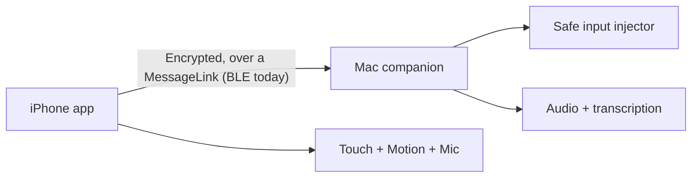

# iPhone BLE Remote for Mac — Hello World MVP Scope

## 1. Objective

Build the smallest end-to-end Apple-only prototype that establishes whether an iPhone can safely and pleasantly act as a Mac remote over Bluetooth Low Energy (BLE), including:

- Touchscreen trackpad input
- Cursor movement, left/right click, scrolling, and dragging
- Keyboard text entry and a small allowlist of hotkeys
- Gyroscope-based “air mouse” input
- Push-to-talk microphone audio transported over BLE and transcribed on the Mac
- QR-based application pairing without using macOS Bluetooth Settings

This is a risk-reduction prototype, not a distributable product. Its output is a go/no-go report for the BLE architecture and a measured list of problems to solve in a production version.

## 2. Primary hypothesis

A foreground iPhone app can advertise a custom BLE service, securely authenticate to a macOS companion app using a one-time QR secret, and transmit input plus voice data with acceptable latency and reliability while the Mac retains its normal internet connection.

## 3. Users and target devices

- One developer/tester
- One physical iPhone running a supported current iOS version
- One Apple-silicon Mac running a supported current macOS version
- Prototype runs first in a separate non-admin macOS user account

Android and Windows are explicitly deferred, but the wire protocol must avoid Apple-specific data types so those clients can be added later.

## 4. In scope

### 4.1 Agent-centric development workflow

- One repository containing the iPhone app, Mac companion, and shared protocol code
- Native Swift/SwiftUI, Core Bluetooth, Core Motion, AVFoundation/Speech, CryptoKit, Core Graphics
- Text-defined Xcode project using XcodeGen
- CLI commands for project generation, build, unit tests, device install, app launch, and logs
- Full Xcode installed, with GUI use limited to Apple ID/signing, device trust/Developer Mode, and occasional debugging

### 4.2 Transport and roles

- iPhone acts as BLE peripheral and advertises one custom service
- Mac acts as BLE central, scans for that service, and initiates the connection
- No OS-level Bluetooth device selection is required
- BLE is the only runtime data transport in this MVP
- A simulated in-process transport supports protocol and UI tests without physical BLE

### 4.3 QR application pairing

- Mac displays a one-time QR code
- QR contains protocol version, Mac display name, ephemeral public key, random one-time secret, pairing identifier, and expiration
- Token expires within 120 seconds and can be used once
- Phone scans the code and begins BLE advertising; the Mac shows one explicit Allow/Don't Allow prompt before answering the handshake
- Apps authenticate using CryptoKit X25519 key agreement, HKDF, and authenticated encryption
- Trusted device keys are persisted in Keychain
- Replayed, expired, malformed, and unknown pairing attempts are rejected
- Pairing is application-level; OS Bluetooth bonding is not required

### 4.4 Shared wire protocol

Every encrypted envelope includes:

- Protocol version
- Session ID
- Monotonic sequence number
- Message type
- Timestamp
- Authenticated payload

MVP message types:

- Heartbeat/current input state
- Pointer delta
- Scroll delta
- Mouse button transition
- Text input
- Allowlisted hotkey
- Motion pointer delta
- Audio chunk
- Acknowledgement
- Connection/status/error

### 4.5 Safe Mac input injection

- Mac requests Accessibility permission, but not administrator, Input Monitoring, Screen Recording, or Full Disk Access
- Pointer and keyboard events are generated with public macOS APIs
- Input is rejected while the Mac is locked, sleeping, logged out, unpaired, or unauthenticated
- Mouse buttons and modifiers are tracked as explicit state
- Reliable transitions use acknowledgement, retry, and deduplication
- A 500 ms heartbeat timeout releases all remotely held buttons and modifiers
- `releaseAllInputs()` runs on disconnect, lock, sleep, logout, startup, and clean shutdown
- A visible menu-bar connection indicator and Pause Remote Control control are present
- No arbitrary scripts, shell commands, user-defined macros, or remote application launching

### 4.6 Touchscreen trackpad

- One-finger motion sends relative pointer deltas
- Tap sends an atomic left click
- Two-finger tap sends an atomic right click
- Two-finger vertical motion scrolls
- Double-tap-and-hold supports drag after the safety layer is proven
- Sensitivity is adjustable locally on the phone
- Touch events are sampled/coalesced at display cadence and sent at up to 100 Hz

### 4.7 Keyboard and hotkeys

- Text entry supports ordinary Unicode text
- Shortcuts are represented separately from text using explicit physical modifier/key transitions
- Initial allowlist: Copy, Paste, Undo, Redo, Select All, Escape, Return, Tab, and arrow keys
- Hotkeys are transmitted as atomic complete actions, never as arbitrary key scripts
- Long-held modifiers are not included until fault testing passes

### 4.8 Gyroscope air mouse

- Core Motion `CMDeviceMotion` sampled at up to 100 Hz
- Cursor movement derives from fused attitude/rotation, not double-integrated acceleration
- Hold-to-activate clutch freezes movement when released
- Clutch activation resets the relative reference orientation
- Dead zone and low-latency smoothing filter reduce tremor
- Nonlinear acceleration curve provides precision at low angular velocity and speed at high angular velocity
- Touchpad and air-mouse modes emit the same pointer-delta protocol messages

### 4.9 Voice and transcription proof

- Push-to-talk only; microphone cannot be activated remotely
- iPhone captures 16 kHz mono audio
- First implementation sends raw 16-bit PCM over BLE to test a deliberately demanding bandwidth case
- Mac reassembles sequenced chunks, displays a live level/health indicator, and writes a valid WAV file
- Mac runs a basic transcription adapter using the platform Speech framework
- Final transcript is displayed on the Mac and may be inserted through the existing safe text-input path
- Transcription accuracy is not a release criterion; transport continuity and end-to-end plumbing are

### 4.10 Lifecycle and recovery

- Previously trusted devices reconnect automatically when both apps are active
- Turning Bluetooth off/on recovers without deleting stored trust
- Mac sleep/wake and iPhone foreground/background transitions return to a safe disconnected state and can reconnect
- Deleting trust on either device prevents reconnection until a new QR pairing

## 5. Explicit non-goals

- App Store, TestFlight, notarized public distribution, subscriptions, or accounts
- Android or Windows clients
- Wi-Fi, peer-to-peer Wi-Fi, cloud relay, WebRTC, or remote internet control
- Generic Bluetooth HID behavior or appearance in macOS Bluetooth Settings
- Control from the iPhone lock screen or while the iPhone app is suspended
- Mac login screen, FileVault unlock, secure desktop, or privileged application control
- Screen viewing, clipboard synchronization, file transfer, arbitrary macros, shell execution, or application automation
- Production transcription accuracy, speaker diarization, wake word, or continuous background recording
- Visual polish beyond clear functional states and safety controls

## 6. Architecture



Recommended source layout:

```text
PhoneRemote/
├── project.yml
├── Config/
├── Shared/
│   ├── Protocol/
│   ├── Crypto/
│   ├── Transport/          # MessageLink, the seam a new wire implements
│   │   └── BLE/            # framing and the GATT contract
│   ├── Observability/
│   └── TestTransport/
├── iPhone/
│   ├── Bluetooth/
│   ├── Link/               # BLEMessageLink
│   ├── Pairing/
│   ├── Input/
│   ├── Trackpad/
│   ├── MotionPointer/
│   ├── Haptics/
│   ├── Audio/
│   └── Debug/
├── Mac/
│   ├── Bluetooth/
│   ├── Link/               # BLEMessageLink
│   ├── Pairing/
│   ├── InputInjection/
│   ├── Transcription/
│   └── Debug/
└── Tests/
```

## 7. Success criteria and go/no-go gates

### Gate A — Toolchain and physical-device loop

- Agent can generate, build, test, install, launch, and collect logs using documented CLI commands
- Both apps launch on the physical devices with stable signing identities

### Gate B — BLE link

- Phone is discovered and connected without opening Bluetooth Settings
- Continuous 100 Hz synthetic pointer packets run for 30 minutes
- Round-trip latency p95 is at most 50 ms
- No unexplained transport stall exceeds 250 ms

### Gate C — Pairing security

- Scan plus one confirmation on the Mac establishes trust
- Unknown phones, modified QR payloads, expired tokens, and QR replay attempts are rejected
- Reconnection uses stored device keys and never silently trusts a new device

### Gate D — Input safety

- Touchpad, clicks, scrolling, allowlisted hotkeys, and air mouse work in ordinary Mac apps
- 100 forced disconnects during mouse-down and modifier-down states produce zero stuck buttons or modifiers
- Locked/sleeping Mac discards remote input
- Quitting or pausing the Mac helper immediately stops control

### Gate E — Air mouse

- Cursor is stable when the phone is stationary
- Clutch permits recentering without moving the cursor
- User can select targets around 32 px in size from normal presentation distance after calibration

### Gate F — Voice path

- At least five minutes of 16 kHz mono PCM crosses BLE without corrupting the reconstructed WAV
- Missing or late audio chunks are measured and surfaced
- A spoken sentence produces visible transcript text on the Mac
- Pointer control remains responsive while voice is streaming

### Final decision

Proceed to a product MVP only if Gates A–F pass on the target Mac/iPhone pair. If raw PCM fails but controls remain reliable, test Opus/AAC compression before rejecting BLE. If input-state safety cannot pass the disconnect test, stop and redesign before adding features.

## 8. Instrumentation

Capture locally, without recording input content. Built unless noted:

- Link connection and reconnection, as phone `link` and `reconnect` events
- Packet counts by message type, as `cursorEvents` and `lastApplicationMessage`
- Retries and acknowledgements, in `ReliableInputCoordinator`
- Sequence gaps and duplicates: enforced by the `PairingSession` replay window, but
  **not counted** for display. Open.
- Round-trip latency, as `link.rtt`, reported as median, p95 and worst rather than a
  histogram
- Heartbeat timeouts and forced input releases
- Audio chunk gaps and reconstructed duration, as `audioMissingChunks` and
  `audioTiming`
- Motion sample rate and filtered output rate: **not measured**. Open.
- App lifecycle transitions

Logs must not contain QR secrets, long-term keys, typed text, transcripts, or audio payloads.

## 9. Linear ticket plan

### 1. Scaffold agent-centric Apple workspace

**Priority:** Urgent  
**Depends on:** None

Create the native Swift repository, XcodeGen configuration, iPhone and macOS targets, shared module, simulated transport, unit-test targets, and CLI commands for generation/build/test/device installation/logging.

**Acceptance criteria**

- Clean checkout generates a valid Xcode project
- CLI builds both apps and runs unit tests
- iPhone app installs on a physical device
- Mac app launches with a stable development signing identity
- README documents only the unavoidable GUI steps

### 2. Define versioned encrypted wire protocol

**Priority:** Urgent  
**Depends on:** 1

Define transport-neutral envelopes, message types, serialization, sequence handling, size limits, validation, and a simulated in-process link.

**Acceptance criteria**

- Round-trip tests cover every MVP message type
- Malformed, oversized, unknown-version, duplicate, and out-of-order messages are handled deterministically
- Protocol contains no Apple-only framework types
- Fuzz/property tests cannot crash the decoder

### 3. Prove iPhone-peripheral to Mac-central BLE link

**Priority:** Urgent  
**Depends on:** 1, 2

Implement custom GATT advertising on iPhone, service-scoped scanning on Mac, connection state UI, chunking/backpressure, acknowledgements, and latency/sequence telemetry.

**Acceptance criteria**

- Connection requires no macOS Bluetooth Settings interaction
- 100 Hz synthetic deltas run for 30 minutes
- p95 round-trip latency is at most 50 ms
- No unexplained stall exceeds 250 ms
- Bluetooth off/on recovery works

### 4. Implement one-scan QR pairing and encrypted sessions

**Priority:** Urgent  
**Depends on:** 2, 3

Generate one-time QR payloads, open/scan them on iPhone, perform explicit user confirmation, authenticate the BLE session with CryptoKit, and persist/revoke trusted device keys.

**Acceptance criteria**

- Scan plus one tap pairs the devices
- Pairing token expires within 120 seconds and works once
- Modified, replayed, expired, and unknown attempts fail closed
- Reconnect authenticates with stored keys
- Secrets never appear in logs

### 5. Build fail-safe Mac input injection layer

**Priority:** Urgent  
**Depends on:** 2

Create the only module allowed to post synthetic Mac input. Implement explicit state tracking, atomic actions, acknowledgement/retry semantics, watchdog release, lifecycle guards, and Pause Remote Control.

**Acceptance criteria**

- Requests only Accessibility permission
- Rejects input while locked, sleeping, logged out, paused, or unauthenticated
- Releases all inputs on timeout/disconnect/startup/shutdown
- Provides unit tests against a mock event sink
- Does not support scripts, shell commands, or arbitrary macros

### 6. Deliver touchscreen trackpad end to end

**Priority:** High  
**Depends on:** 3, 4, 5

Implement touch sampling, relative pointer deltas, tap-to-click, right click, scrolling, adjustable sensitivity, and guarded drag behavior.

**Acceptance criteria**

- Cursor, left click, right click, and scrolling work in Finder and a browser
- No movement is emitted after touch release
- Click transitions are acknowledged/deduplicated
- Dragging is enabled only after watchdog tests pass

### 7. Deliver safe text entry and allowlisted hotkeys

**Priority:** High  
**Depends on:** 4, 5

Implement separate Unicode text and physical shortcut actions with a fixed MVP allowlist and complete atomic key transitions.

**Acceptance criteria**

- Ordinary text can be entered in TextEdit
- Copy, Paste, Undo, Redo, Select All, Escape, Return, Tab, and arrows work
- Keyboard layout tests cover at least US layout plus one non-US layout
- Disconnect cannot leave a modifier held

### 8. Deliver gyroscope air-mouse mode

**Priority:** High  
**Depends on:** 3, 5

Implement Core Motion sampling, clutch activation, relative quaternion/rotation mapping, dead zone, smoothing, acceleration curve, sensitivity controls, and shared pointer-delta output.

**Acceptance criteria**

- Stationary phone produces no visible cursor drift
- Releasing clutch freezes the cursor
- Re-engaging clutch establishes a new neutral pose
- Presentation-distance target selection meets Gate E

### 9. Prove push-to-talk audio and Mac transcription path

**Priority:** High  
**Depends on:** 3, 4

Capture 16 kHz mono PCM on iPhone, send sequenced audio chunks over BLE, reconstruct a WAV on Mac, display stream health, run basic macOS transcription, and optionally insert the transcript through safe text entry.

**Acceptance criteria**

- Five-minute reconstructed WAV has correct format and duration
- Gaps/late chunks are measured and surfaced
- A spoken sentence produces visible Mac transcript text
- Pointer p95 latency remains within 50 ms during streaming
- Mac cannot remotely start the microphone

### 10. Harden reconnect and lifecycle behavior

**Priority:** High  
**Depends on:** 3, 4, 5, 6, 7, 8, 9

Handle Bluetooth state changes, iPhone foreground/background transitions, Mac sleep/wake, lock/unlock, helper restart, trust revocation, and clean reconnection.

**Acceptance criteria**

- Every transition reaches a documented safe state
- Trusted-device reconnect succeeds without rescanning QR
- Revoked devices cannot reconnect
- No transition leaves remote input active

### 11. Execute fault-injection matrix and publish go/no-go report

**Priority:** Urgent  
**Depends on:** 1–10

Run the complete Gates A–F test matrix on the target devices, record measurements, identify blockers, and recommend BLE continuation, compression follow-up, hybrid transport, or termination.

**Acceptance criteria**

- 100 forced disconnect tests produce zero stuck inputs
- Latency, stalls, reconnection, sequence gaps, audio integrity, and motion stability are reported
- Tests include AirPods connected and heavy Wi-Fi traffic
- Report includes an explicit go/no-go decision and the smallest next scope

## 10. Suggested execution order

1. Scaffold and protocol
2. BLE link
3. QR authentication and safe input layer in parallel
4. Touchpad and keyboard
5. Air mouse
6. Audio/transcription
7. Lifecycle hardening
8. Fault-injection report

The prototype should remain on a branch or repository that contains no unrelated production credentials or sensitive data.
